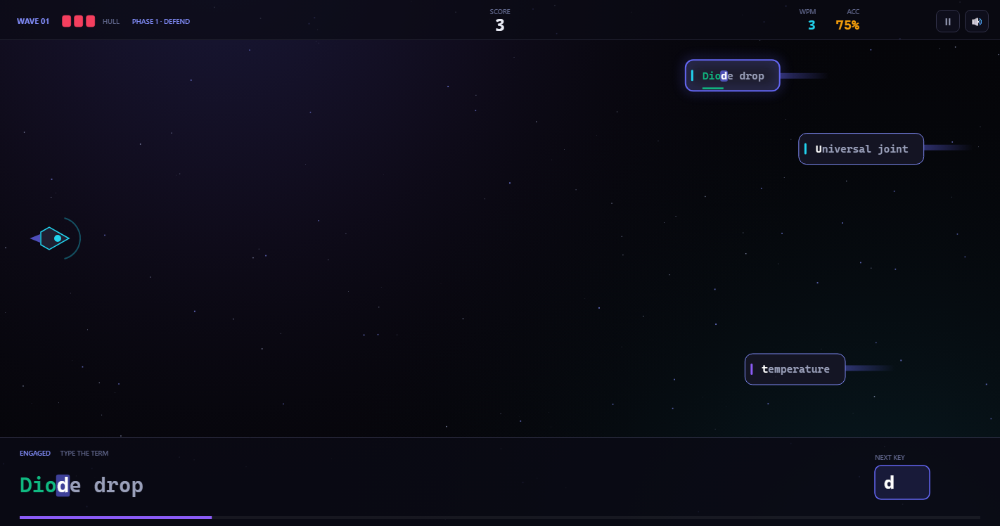
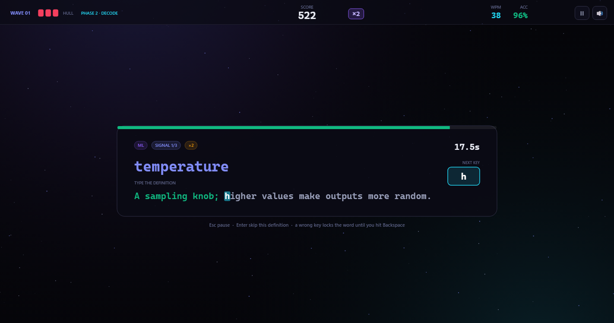

# Vocab Strike

A ZType-style typing game built over the **Ascent** glossary. Type the **term** to
destroy the incoming ship, then type its **definition** to bank the intel.

Inspired by the games on [typing.com/student/games](https://www.typing.com/student/games)
— specifically **ZType**, where you type the letters attached to incoming objects to
blow them up. The twist here is the two-phase loop: terms are the arcade layer,
definitions are the study layer.




Open `index.html` in a browser. No build step, no server, no dependencies —
`data.js` is a plain script tag, so it works straight off `file://`.

---

## The loop

| Phase | What you type | What happens |
|---|---|---|
| **1 · DEFEND** | The **term** on each ship | Correct key → the ship takes damage; finish the word → it explodes, +60 × combo, and the term is salvaged. A ship that reaches your hull costs 1 hull. |
| **2 · DECODE** | The **definition** of every salvaged term | Type it before the timer runs out for a speed bonus. Run out and the card is marked missed. No game over here — definitions only affect score. |

Then the next wave starts, faster and larger.

**Rules**

- Comparison is **case-insensitive** — `4-20 ma` scores the same as `4-20 mA`.
- **A wrong key locks the word.** The mistake is committed: it costs accuracy,
  resets your combo, and the word stops accepting letters until you press
  **Backspace** to clear it. Backspace does nothing when there's no mistake.
- `Esc` pause · `Enter` skip a definition · `M` mute (menu and pause only, since
  `M` is a letter you type during play).
- Combo multiplies score every 15 clean keystrokes, up to ×5.

**Controls in the menus** — `Enter` start / restart, `Esc` back from game over,
`Q` quit to menu while paused. Everything is also clickable.

---

## Word lists

Everything comes from the Ascent career-planner project:

- `vocab_definitions.yaml` — the Learning-track glossary (controls + ML/CV)
- `engineering_formulas.yaml` — electrical / mechanical / mechanisms entries

`glossary.py` merges both and infers each term's domain from its track file, so
the game inherits the same four decks:

| Deck | Entries |
|---|---|
| All systems | 286 |
| ML / CV | 157 |
| EE + Mech | 86 |
| Controls | 43 |

### Adding your own words

Click the dashed **+ Add words** chip in the Deck group (or click the **My words**
chip when it's empty). The editor opens over the menu:

1. Type a **term** and a **definition** — the preview shows exactly what you'll
   type, already ASCII-normalised the same way the built-in lists are (so `≥`
   becomes `>=`, `φ` becomes `phi`, smart quotes become straight ones).
2. **Formula** is optional and display-only — it appears in the DECODE results
   banner but is never typed.
3. Hit **Add word** (or just press `Enter`). Duplicates are rejected, and the
   word is playable immediately — it joins the **My words** deck, counts inside
   **All systems**, and shows up in the very next run.

Your words persist in `localStorage` (`vocabstrike.words.v1`), so they survive
reloads and browser restarts but never touch `data.js`. Use **Export** to save
the list as JSON and **Import** to load one back — re-importing the same file
de-duplicates instead of doubling up. Words you add are listed in the panel
with a delete button each.

### Regenerating the data

```
"<Ascent>/.venv/Scripts/python.exe" build_data.py
```

The Ascent checkout defaults to the path at the top of `build_data.py`; set
`ASCENT_DIR` to point it elsewhere.

`build_data.py` reads the YAML through Ascent's own `glossary.py` (so domain tags
and definitions stay identical to what the app shows), then writes `data.js`.

It also **ASCII-normalises** the text so every target is something a US keyboard
can actually produce. You still see the original notation in the DECODE results
banner; what you type is the plain-ASCII form:

| source | you type |
|---|---|
| `P = V·I·cosφ` | `P = V*I*cos phi` |
| `Z = √(R² + (XL - Xc)²)` | `Z = sqrt(R^2 + (XL - Xc)^2)` |
| `Timer Off-Delay — output stays on…` | `Timer Off-Delay - output stays on…` |

After a build the script reports whether any *terms* needed normalising (today:
none) plus entry counts and definition length range.

---

## Difficulty

| | Ships | Timer | Hull |
|---|---|---|---|
| **Cadet** | 70% speed | 145% longer | 5 |
| **Operator** | baseline | baseline | 3 |
| **Vanguard** | 145% speed | 76% of baseline | 2 |

Ship speed and spawn rate also scale with the wave number. Definition timers are
derived from length (`6s + 0.25s × characters`), so a 140-character definition
gets ~41s on Cadet and ~21s on Vanguard.

---

## Files

```
index.html        markup + styles (palette mirrors Ascent's frontend tokens)
game.js           engine: game loop, input, render, WebAudio SFX
data.js           generated word list — do not edit
words.js          your word store: localStorage persistence, sanitize, import/export
build_data.py     regenerates data.js from the Ascent YAMLs
test/audit.mjs    checks every entry has a real, typable definition
test/smoke.mjs    plays a full run over the Chrome DevTools Protocol
```

### Design notes

- **Palette** matches Ascent's active `frontend/src/style.css` tokens: ink
  `#050509`, brand indigo `#6366f1`, cyan `#22d3ee`, danger `#f43f5e`.
- **Typing focus** works like ZType: a ship becomes *engaged* when you land its
  first character. While engaged you're locked to that word — pressing something
  else is an error rather than a silent switch. Before you engage, the nearest
  ship is suggested in the prompt bar with a `NEXT KEY` box, so accuracy misses
  are genuinely your mistake rather than guesswork.
- `window.VS` is a dev handle: `VS.S` is the live state, `VS.pressKey('a')`
  sends a keystroke. That's what the smoke test drives.

### Running the test

Audit the word list first — every entry must have a real, typable definition:

```
node test/audit.mjs
```

It flags empty or placeholder definitions, definitions shorter than 12 typable
characters, unknown decks, and duplicate terms (exact duplicates fail; purely
case-insensitive collisions like `mAP` vs `map` are warnings, since typing is
case-insensitive by design).

Then play the game end to end. Needs Chrome; it loads `index.html` straight off
`file://`, so there is no server to start:

```
node test/smoke.mjs
```

Set `CHROME_PATH` if Chrome isn't in the default Windows location, and `VS_URL`
to test a served copy instead. Both run in CI on every push
(`.github/workflows/test.yml`).

It walks the custom-word editor (add, duplicate rejection, export/import, a
full run on the **My words** deck) then DEFEND → DECODE → wave 2 → hull loss →
game over → restart → pause, asserts state at each step, fails on any console
or page exception, and writes screenshots to `test/shots/` (menu, defend,
decode typing, decode result banner, word editor, game over, pause).
